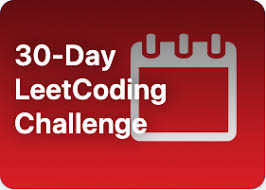

# LeetCode-30-Day-Challenge
In order to help you stay focussed, LeetCode is running the 30-Day LeetCoding Challenge for the month of April. Each day, we'll challenge you ...

  

      Introduction
Welcome to the 30-Day LeetCoding Challenge!
Check out the announcement if you're not sure what this is all about. Also, don't forget to add the event to your calendar!

With many of us around the world being encouraged to stay indoors and work from home, this is the perfect opportunity for you to focus on studying up for future code interviews. In order to help you stay focussed, LeetCode is running the 30-Day LeetCoding Challenge for the month of April. Each day, we'll challenge you to solve a frequently-asked interview problem.

As a further motivation, completing a problem on the same day it appears here will reward you with LeetCoins. Completing all 30 on the day they appear will reward you with even more LeetCoins, and an entry into a prize draw where 3 lucky winners will win cool prizes! More details on the prizes can be found in the announcement.

So anyway, how this works is that we've split the month up into 5 weeks, with 1 chapter for each week. Each day at 00:00 AM Pacific Standard Time, a new problem will appear. You'll then have 24 hours to submit a correct answer for that problem.

If you've previously solved the problem before, you must resubmit for it to be counted.

If you miss a problem, it'll still be here for you, however, you won't get any LeetCoins for it, and you'll no longer be eligible for the prize draw.

Good luck, and happy coding! We wish you all the best with your interview preparation.

  

If you have any questions about the solutions you can find here, feel free to contact me **jeevankumarparsad@gmail.com**.
